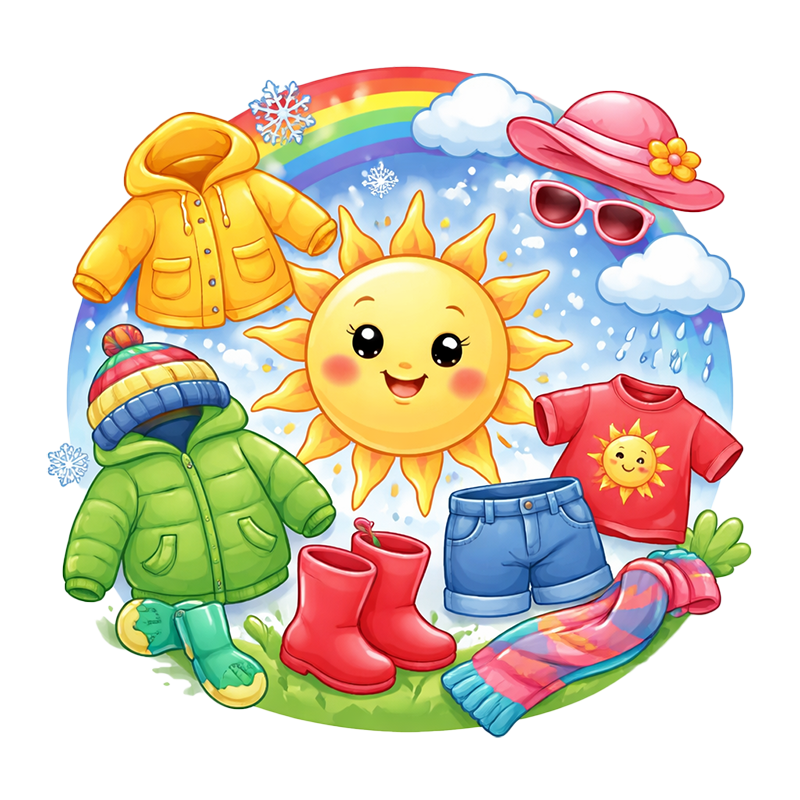

[](https://nextjs.org)

# Kläder efter Väder — En omtänksam väderapp som ger tips på vad man ska ta på sig för kläder. 

En liten, trevlig väderapplikation byggd med Next.js och TypeScript. Appen visar aktuell väderinformation och ger enkla, praktiska kläd- och aktivitetsråd i en varm, lättsam ton — perfekt för familjer och barn.
Webbappen riktar sig fämst till barn och ungdommar som har funktionsnedsättning som exempel IF, Autism och andra personer som har svårt att välja kläder efter väder. 


## Funktioner

- Sökväder för valfri ort
- Aktuell väderinformation: temperatur, känslotemp, luftfuktighet, vind och väderbeskrivning
- "Mamma säger...": korta, användbara klädtips baserat på väderförhållanden
- Prognoser för kommande timmar
- Enkel felhantering vid ogiltiga orter

## Teknisk stack

- Next.js (App Router)
- TypeScript
- React
- Enkel CSS (finns i `src/app/globals.css`)

## Kom igång (lokalt)

1. Klona repot

```bash
git clone https://github.com/<ditt-användarnamn>/mammasvader.git
cd mammasvader
```

2. Installera beroenden

```bash
npm install
# eller: pnpm install, yarn
```

3. Skapa en `.env.local` i projektets rot med dina API-nycklar (exempel nedan)

```
NEXT_PUBLIC_WEATHER_API_KEY=din_api_nyckel
NEXT_PUBLIC_WEATHER_BASE_URL=https://api.openweathermap.org
```

4. Starta utvecklingsservern

```bash
npm run dev
```

Öppna http://localhost:3000 i din webbläsare.

## Projektstruktur (viktiga filer)

- `src/app/` — Next.js app-katalog (sidor och layout)
- `src/components/` — UI-komponenter (Header, Footer, WeatherCard, Forecast, SearchInput)
- `src/hooks/useWeather.ts` — Hook för väderlogik
- `public/` — statiska filer (bilder, screenshot)

## Miljövariabler

- `NEXT_PUBLIC_WEATHER_API_KEY` — API-nyckel för vädertjänst
- `NEXT_PUBLIC_WEATHER_BASE_URL` — (valfritt) bas-URL för vädertjänsten


