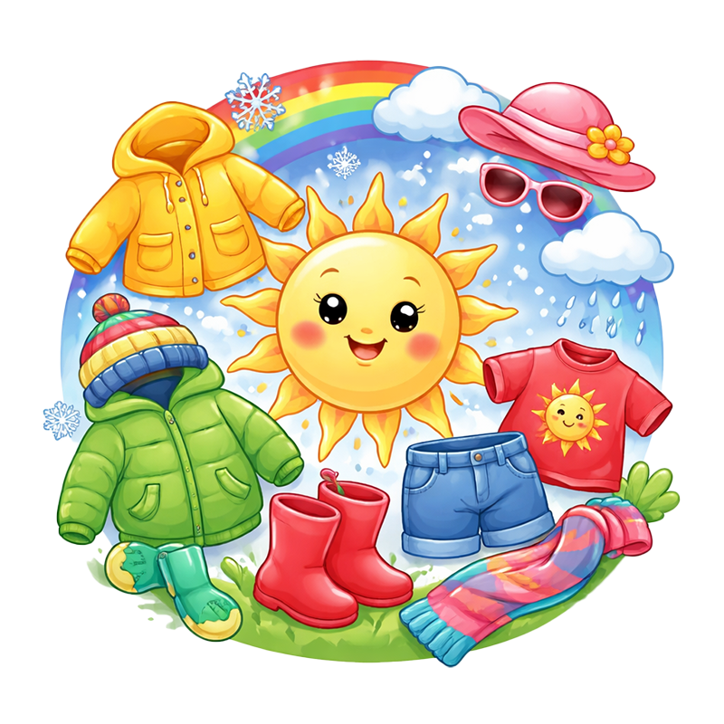

[](https://nextjs.org)

# Dress for the Weather — A thoughtful weather app that provides clothing suggestions.

A small, friendly weather application built with Next.js and TypeScript. The app displays current weather information and provides simple, practical clothing and activity advice in a warm, casual tone — perfect for families and children. The web app is primarily aimed at children and adolescents with disabilities such as intellectual disabilities, autism, and others who have difficulty choosing clothes according to the weather.



## Features

- Search weather for any location
- Current weather information: temperature, feels-like temperature, humidity, wind, and weather description
- "Mom says...": short, useful clothing tips based on weather conditions
- Forecasts for upcoming hours
- Simple error handling for invalid locations

## Tech Stack

- Next.js (App Router)
- TypeScript
- React
- Simple CSS (located in `src/app/globals.css`)

## Getting Started (locally)

1. Clone the repository

```bash
git clone https://github.com/<your-username>/mammasvader.git
cd mammasvader
```

2. Install dependencies

```bash
npm install
# or: pnpm install, yarn
```

3. Create a `.env.local` file in the project root with your API keys (example below)

```
NEXT_PUBLIC_WEATHER_API_KEY=your_api_key
NEXT_PUBLIC_WEATHER_BASE_URL=https://api.openweathermap.org
```

4. Start the development server

```bash
npm run dev
```

Open http://localhost:3000 in your web browser.

## Project Structure (important files)

- `src/app/` — Next.js app directory (pages and layout)
- `src/components/` — UI components (Header, Footer, WeatherCard, Forecast, SearchInput)
- `src/hooks/useWeather.ts` — Hook for weather logic
- `public/` — static files (images, screenshot)

## Environment Variables

- `NEXT_PUBLIC_WEATHER_API_KEY` — API key for weather service
- `NEXT_PUBLIC_WEATHER_BASE_URL` — (optional) base URL for the weather service
